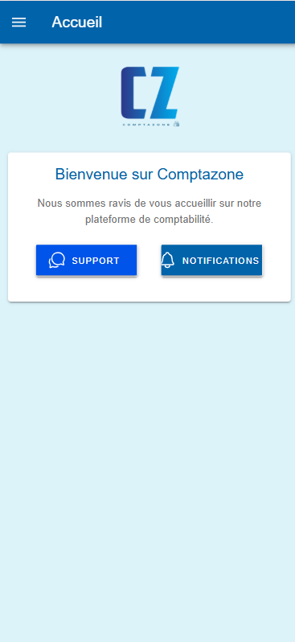
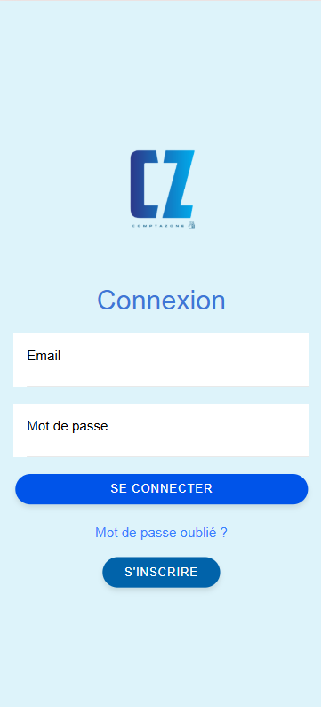
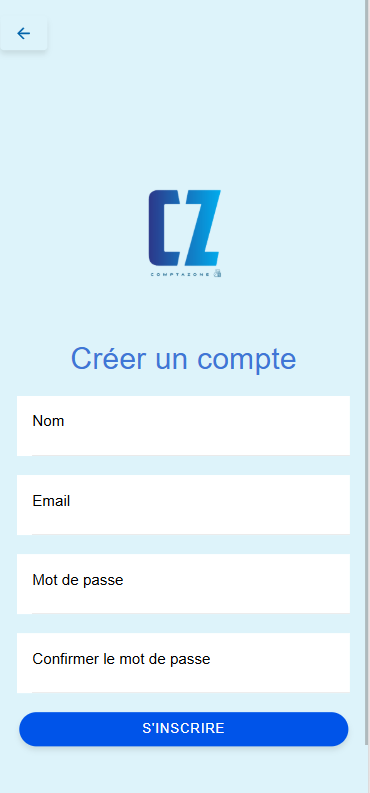
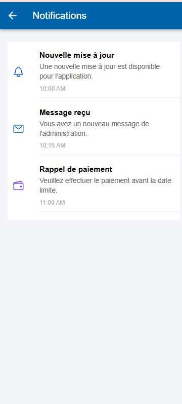
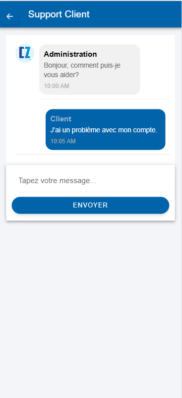
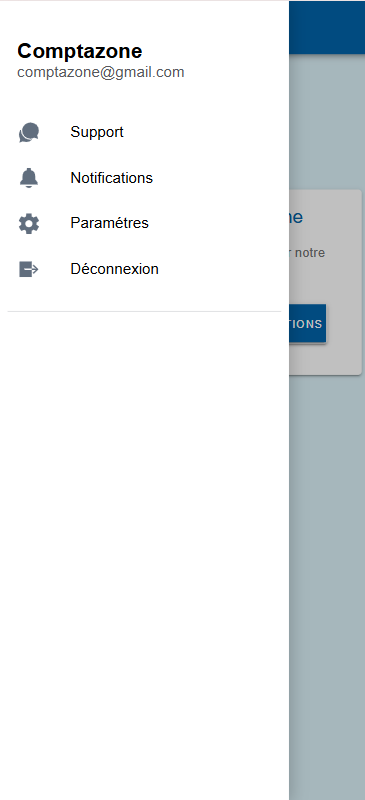

# 📱 Comptazone Mobile – Prototype d’Application

Ce projet est un **prototype d'application mobile** développé avec **Ionic + Angular** dans le cadre d’un stage.  
L’application vise à offrir une expérience simple de communication entre un client et l’administration de Comptazone.


## 🖼️ Aperçu de l’application

### 🏠 Accueil


### 🔐 Connexion


### 🆕 Inscription


### 🔔 Notifications


### 💬 Support / Messagerie


### 📋 Menu / Toolbar



## ▶️ Lancer le projet

### En développement

```bash
npm install
ionic serve
